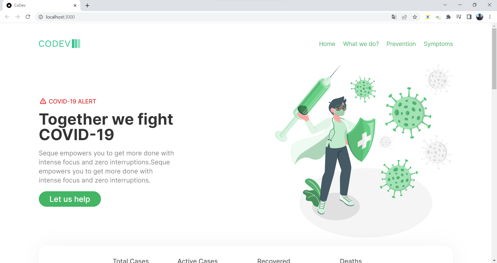
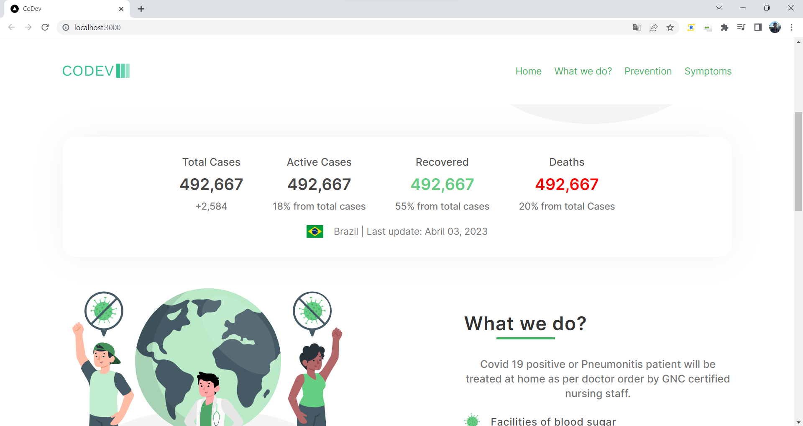
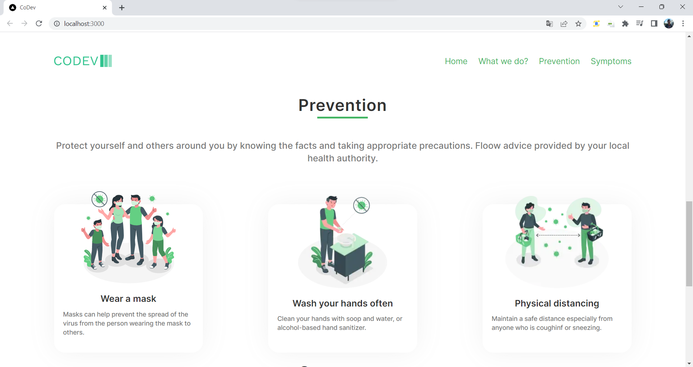
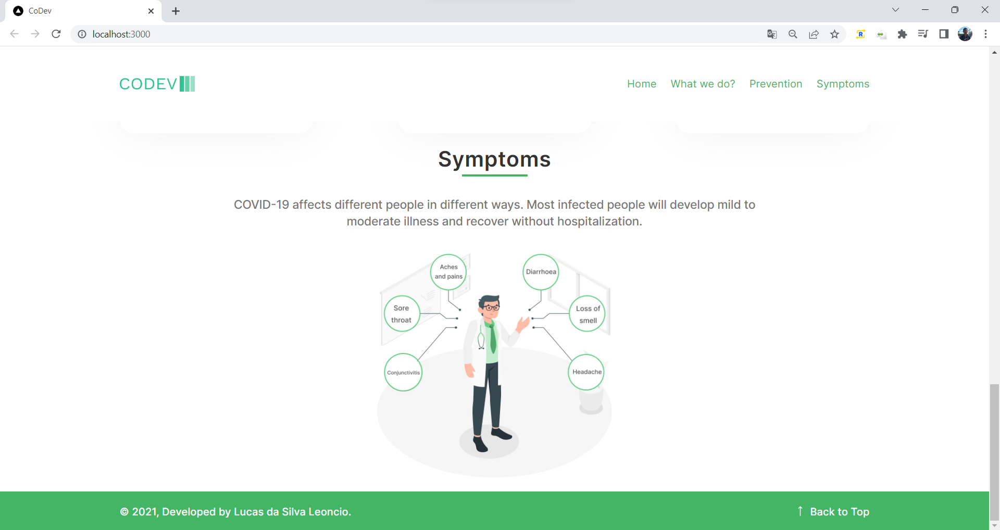

# :pill: Codev :laptop:

## Descrição: 

Este projeto tem como foco a criação de uma singlepage para apresentar dados sobre o covid-19, sintomas e como prevenir a propagação desta doença fatal utilizando next js 13 e tailwind css.

## Justificação:

Tailwind CSS é uma biblioteca de estilos utilitários que oferece classes prontas para serem aplicadas aos elementos HTML. Em vez de escrever CSS personalizado, os desenvolvedores podem utilizar as classes predefinidas para definir estilos. A biblioteca também oferece recursos de responsividade, permitindo que os estilos sejam adaptados a diferentes tamanhos de tela.
 
Com relação ao Next.js, ele suporta a renderização no lado do servidor, o que significa que as classes do Tailwind CSS podem ser geradas de forma dinâmica no servidor, o que ajuda a melhorar o desempenho.

O Next.js é um popular framework de desenvolvimento web em React que oferece recursos avançados, como renderização do lado do servidor (SSR), geração de estáticos (SSG), roteamento, suporte a APIs e muito mais. Ele é amplamente utilizado para a criação de aplicativos web modernos e escaláveis, e é uma escolha popular para muitos desenvolvedores e equipes de desenvolvimento.

Com a chegada da versão 13 do Next Js, novas formas de modelagem de sites e requisições foram adicionadas. Então esse projeto vem como modelo de estudo.

## Imagens:

